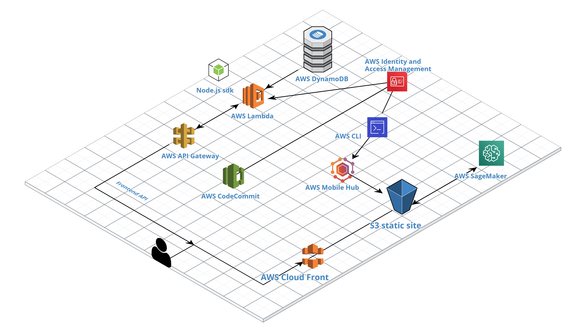

# Course-Garage

Course Garage is a web-app built on AWS serverless architecture.

The front-end is built using React, Redux is used for state management and Node is used for backend and lambda functions

React app created with [Create React App](https://github.com/facebookincubator/create-react-app)

## AWS API Gateway 
​We created a REST API web application that we used to show the data on the front end of the application. In this API gateway will pass the request to the lambda function and return the user the object returned by the lambda function.

## AWS Lambda
Lambda functions are used to read and write data from the database and those functions are built using Node.js runtime environment with javascript sdk. It will run whenever a request hits one of the API endpoints. We have created 6 lambda functions using node.js for this application. The lambda functions and their descriptions are mentioned in Table 1.1 above.

## AWS CloudFront 
​CloudFront is a content delivery network of AWS which is used to accelerate the delivery of the content or files to the end users. So it basically acts as a distributed cache of our files and is saved around all the edge locations of the world. As we have many images in our web-app, CloudFront will help us to deliver the web-app much faster.

## AWS CLI
AWS CLI 2 is configured on a local machine and configured with an IAM user with AdminstratorAccess to use MobileHub and publish the build of the application directly from the CLI of the local machine.

## AWS MobileHub
MobileHub is used to simplify the process of building, monitoring and testing the application and lets us add configurations like CDN, user authentication and much more directly from its console and manages the source code in S3 to host the static website.

## AWS S3
​S3 is used to store the build of our source code and host the static website. We have even used it to store the csv files of our courses dataset and stored all the insights generated by the SageMaker to an S3 bucket in the form of visualisations.
AWS SageMaker - ​AWS sagemaker is used to preprocess and visualise the udemy course dataset and show the insights related to the high demanding free and paid courses on the web application.

## AWS CodeCommit
AWS CodeCommit is used to store the source code and to do version controlling and to collaborate with team members on the repository. It makes it easy to roll back to an older version in case of any bugs or errors.

## AWS Dynamodb
AWS Dynamodb is a NOSQL schema less database that is used to store data in key-value pairs. As we can see there is no schema so every record will be stored in different format but there will be a single partition key which will be present in all the records. In our case we have created two tables "author" and "course" in Dynamodb database with primary key "id" in both tables.

## AWS Identity and Access Management
IAM enables users to manage access to AWS servicesandresources.Wehavecreated IAMrolesandcorrespondingpoliciesforeachlambda function. An IAM user is created to configure the AWS CLI.

# Implementation

## Tech Stack
- React.js for front-end
- Redux for state management
- Node.js for backend
- Bootstrap for styling

## Installing tools
1. Installed Node v12.16.1 [Link](​https://nodejs.org/en/download/​)
2. Installed Node Package Manager (npm) v6.14.5 [Link](​https://www.npmjs.com/get-npm​)
3. Installing AWS CLI [Link]
(​https://docs.aws.amazon.com/cli/latest/userguide/install-cliv2-mac.html​)

### This is how we started with a React App (You can follow this if you’re planning to make you own front-end)

Open terminal and install create-react-app globally using -g

	`$ npm i -g create-react-app`
	
Now navigate to a directory where you want to create the app and execute the following command with name of your project

	`$ npx create-react-app course-garage
	
### Setting up Project with our existing source code

1) You need to first download the project source code that has the react-app to get started.

2) Open the terminal and git clone the project using the following command in a directory
of your choice:
	
	`$ git clone ​https://github.com/parekhjigar/course-garage.git`

3)Now execute the following command to install the required packages that are mentioned
in our package.json

	`$ npm install`
	
4) But before moving further, don’t forget to change the URL of API to ​http:localhost:3000 or any port of your choice in the the serverUrl.js file that you can find inside the directory src/api of the project.This will be later on updated to the API endpoint from the API gateway.

5) You can test the server locally by executing the following command

	`$ npm start`
	
### Configuring AWS CLI and deploying React App

To install for all users of macOS CLI, use sudo
1) Download the AWS CLI file using curl command

	`$ curl "https://awscli.amazonaws.com/AWSCLIV2.pkg" -o "AWSCLIV2.pkg"`
	
2) Now run the standard installer program and specify the downloaded file

	`$ sudo installer -pkg ./AWSCLIV2.pkg -target /`

3) Verify the installation using

	`$ which aws`
		
Expected output: /usr/local/bin/aws

	`$ aws --version`
	
Expected output: aws-cli/2.0.10 Python/3.7.4 Darwin/19.2.0 botocore/2.0.0dev14

### Installing AWSMobile-CLI

	`$ npm install -g awsmobile-cli`

Initializing awsmobile in our application directory that you just cloned from github

	`$ awsmobile init`
	
- After initializing, the terminal prompts a set of questions wherein you can proceed with the defaults by pressing enter and edit some if required.
- Console redirects to aws console for you to login, then press enter to continue.
- Now to proceed with the connection of AWS CLI and your account, you need to create an IAM user, the terminal will redirect to console again to create the user as shown in the
screenshot below.
- Don’t forget to save the .csv file, it has the secret credentials to configure which will only
be displayed once.

After the user is created, you need to copy the accessKeyID and the secretAccessKey in your terminal.

This automatically installs aws-amplify and aws-amplify-react to local project and creates the AWS MobileHub app.

Any changes made to the AWS MobileHub from the console can be pulled or pushed using the following commands

	`$ awsmobile pull`
	`$ awsmobile push`
	
Now you need to work on the react app to build the functionalities of the application as per your requirement.

You can test your react app locally anytime using the following command from the root of your project directory

	`$ npm start`
	
To deploy the app to awsmobile use the following command from the same directory

	`$ awsmobile publish`

After publishing, you can find the build of your app in the S3.